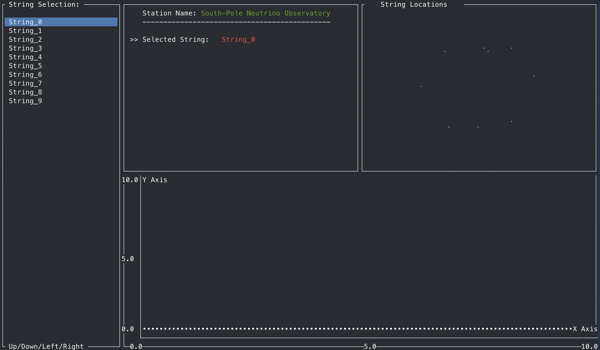
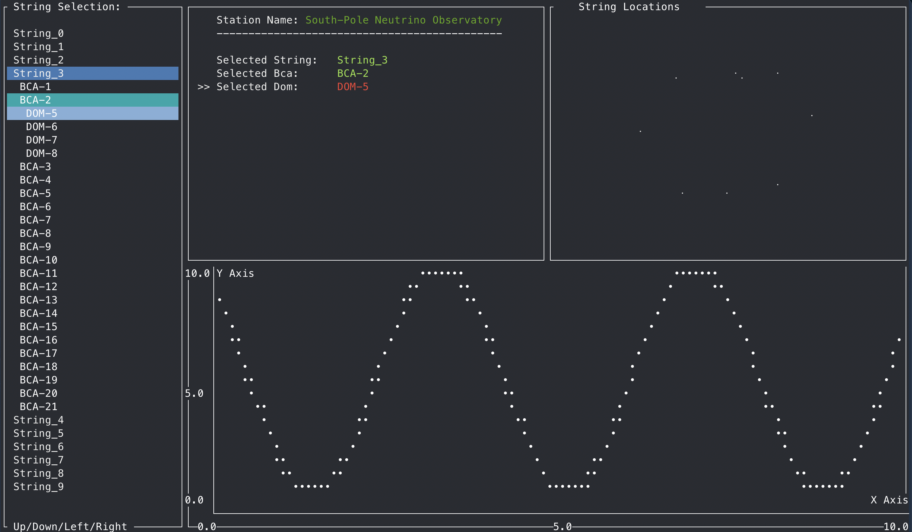

# IceCube System

IceCube System is for generating a visual interface for monitoring DOM sensors and High Energy Muon detection.




## Installation
Use git to install repo
```bash
git clone https://github.com/BenMcConville/IceCube_System
```
## Requirements
Must have the following python3 libraries installed.
- json
- math
- sys

When running (Rust) script for first time Cargo will install the following dependancies.

- crossterm = "0.27.0"
- ratatui = "0.26.3"
- serde = { version = "1.0", features = ["derive"] }
- serde_json = "1.0"

## Usage
1.
From git directory /IceCube_System
```bash
cd IceCube_System
python3 script.py
```
After a few seconds you may be prompted with the following 
```bash
Enter if you would like to continue data generation (y/n): 
```
Stop here and open another terminal window. Enter the git directory /IceCube_System.
```bash
cd IceCube_System
cargo run
```
Once the rust ui is displayed you can enter the previous terminal and enter y. Using the arrow keys you can view the individual doms to view the generated data.


Main page with generated data from python script.
